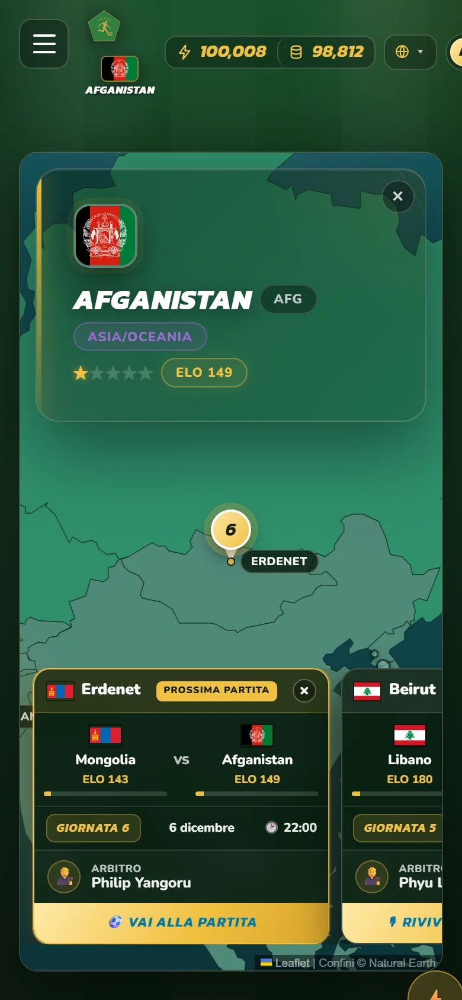
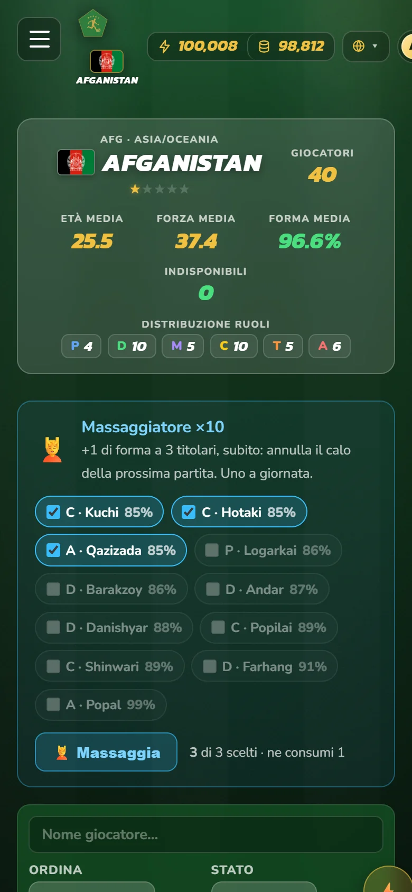
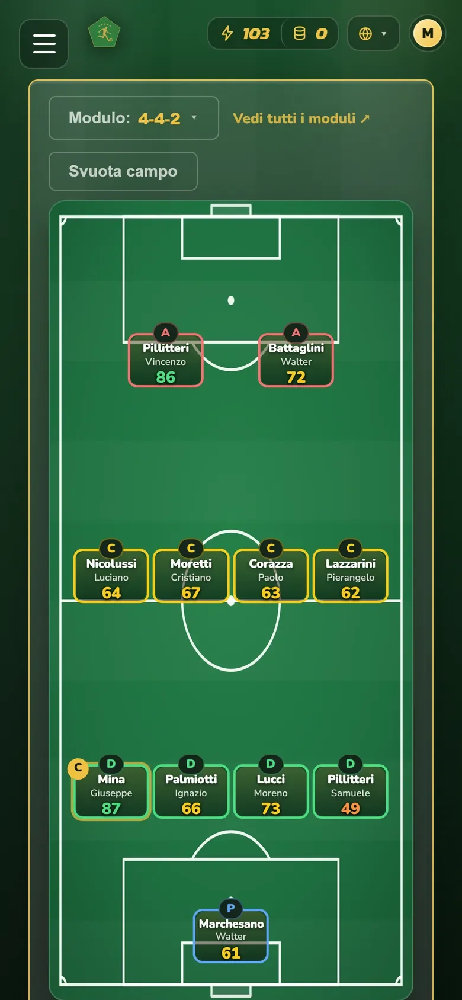
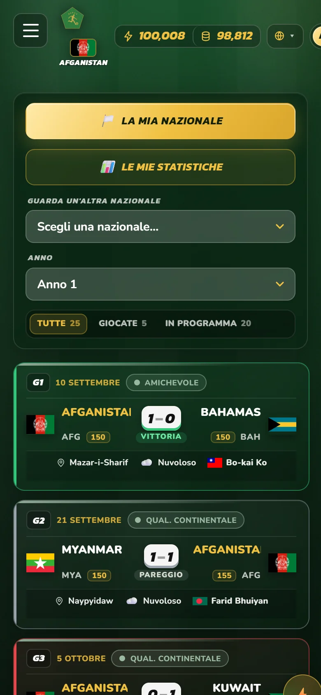
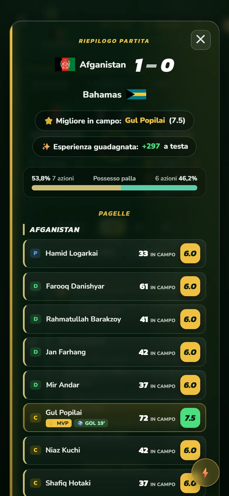
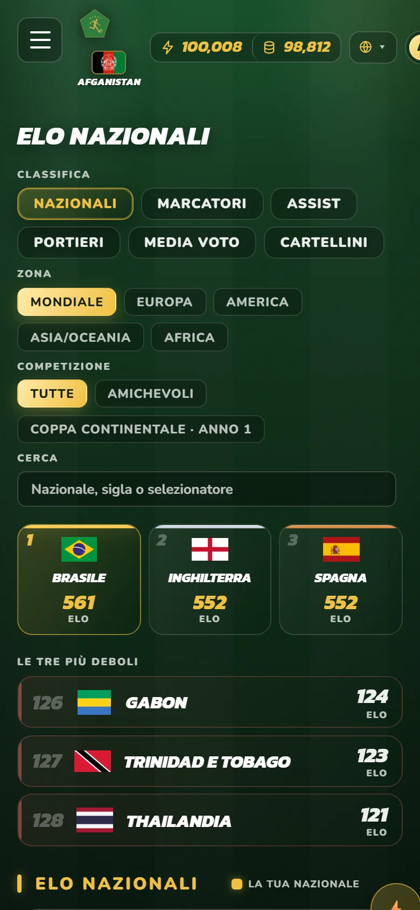
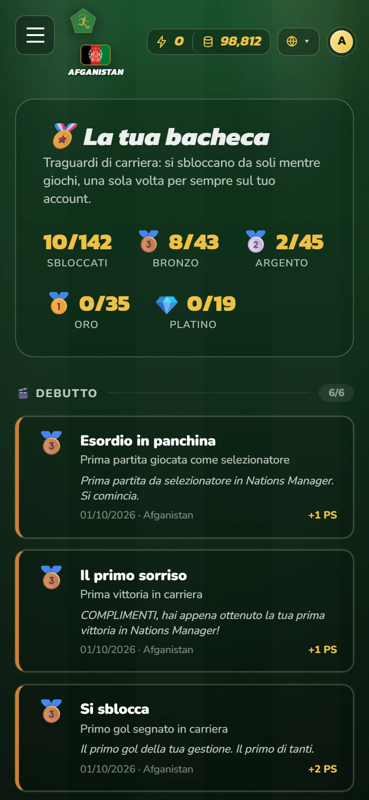
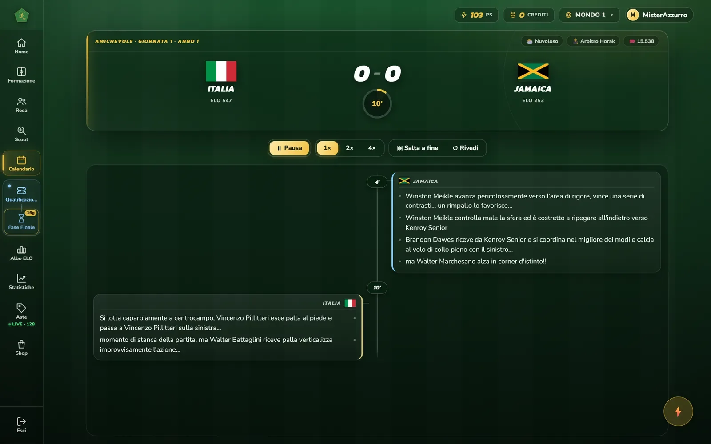
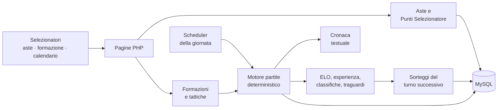

# Nations Manager

**Il gioco manageriale di calcio in cui alleni una nazionale, non un club.** Ogni giocatore diventa il selezionatore di una delle 128 nazionali, se la conquista all'asta e la porta dalle qualificazioni fino alla Coppa del Mondo, contro altri allenatori veri.

> 🚧 **In sviluppo.** Il ciclo di gioco funziona dall'asta alla fase finale del Mondiale. Mancano la fine della stagione (mercato e nuovo calendario) e la pubblicazione online.
>
> 🔒 Il codice sorgente è in un repository privato. Questa pagina descrive il progetto, le scelte tecniche e lo stato dei lavori: se vuoi vedere il codice, [scrivimi](#contatti) e te lo mostro.

## Screenshot

  
  
  
  

  
  
  

  
   <em>La telecronaca in diretta, nella versione desktop.</em>

## Cosa fa

- 🌍 **128 nazionali in 4 federazioni** (Europa, America, Asia/Oceania, Africa), ognuna con la sua forza di partenza e il suo ranking ELO.
- 🔨 **Aste a busta chiusa** per prendersi una nazionale, pagate con i Punti Selezionatore guadagnati giocando. Chi perde l'asta non perde i punti.
- 🗺️ **Più mondi in parallelo**: quando un mondo si riempie, il gioco ne prepara uno nuovo da solo e i nuovi iscritti finiscono nel primo con posti liberi.
- 👥 **Rose da 40 calciatori** generate per ogni nazionale (5.888 per mondo), con ruoli, caratteristiche, esperienza, invecchiamento e ritiro.
- 📋 **15 moduli e 13 tattiche** (catenaccio, tiki-taka, pressing, falso nueve…), capitano, panchina e fino a 6 sostituzioni programmate al minuto.
- ⚽ **Partite simulate con la cronaca scritta**: azioni, gol, cartellini, infortuni, sostituzioni, supplementari e rigori, raccontati con oltre 200 frasi e i nomi dei calciatori in campo.
- 🌦️ **Meteo e arbitri che contano**: 1.024 città ospitanti con il loro clima mese per mese e 128 arbitri con un carattere (permissivo, severissimo, imprevedibile…) che cambia il numero di cartellini.
- 🏆 **Due competizioni a stagione**: Coppa Continentale e Coppa del Mondo, con gironi, classifiche, fasi finali e un'asta per decidere il paese ospitante.
- 🏅 **Oltre 130 traguardi di carriera** a rarità (bronzo, argento, oro, platino), con premi e una bacheca.
- 🛠️ **Pannello di amministrazione** con una procedura guidata a passi per creare e avviare un mondo, generare le rose e gestire gli utenti.
- 🔐 **Account completi**: registrazione con conferma email, recupero password, profilo con avatar, autocancellazione dell'account con anonimizzazione dei dati.

## Stack

| | |
|---|---|
| Backend | PHP 8, senza framework, classi separate per aste, sorteggi, simulazione e cronaca |
| Database | MySQL / MariaDB con PDO e query preparate, installazione da script SQL idempotenti |
| Frontend | HTML, CSS e JavaScript senza framework, design system proprio |
| Automazione | Le giornate si giocano da sole all'ora impostata per ogni mondo |
| Sviluppo | Costruito con Claude Code, con skill dedicate al collaudo e al bilanciamento del gioco |

## Architettura

## Stato del progetto

| Parte | Stato |
|---|---|
| Registrazione, login, profilo, più mondi | ✅ Funzionante |
| Aste delle nazionali | ✅ Funzionante |
| Rose, formazione, tattiche | ✅ Funzionante |
| Motore partite, cronaca, ELO | ✅ Funzionante |
| Coppa Continentale e Coppa del Mondo | ✅ Funzionante |
| Traguardi di carriera | ✅ Funzionante |
| Fine stagione (mercato, nuovo calendario) | 🟡 In lavorazione |
| Crediti, bonus e pass stagionale | 🟡 Progettati, in sviluppo |
| Pubblicazione online | ⏳ Da fare |

## Contatti

Progetto di **Samuele Previtali** · previsamu@gmail.com · [LinkedIn](https://www.linkedin.com/in/samuele-giovanni-previtali) · [altri progetti](https://github.com/SamuelePrevitali)

---

© 2026 Samuele Previtali. Tutti i diritti riservati.
